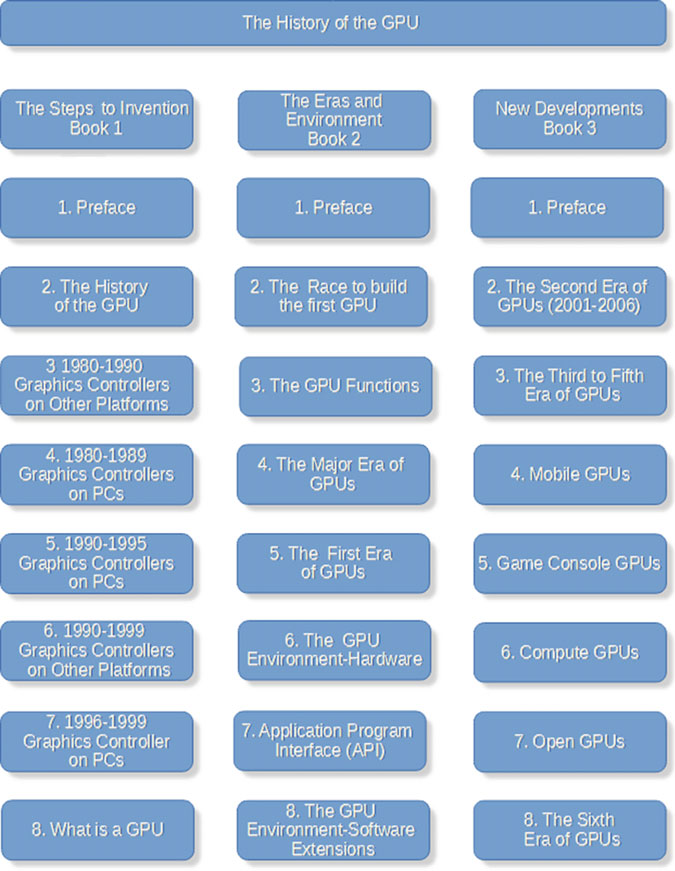

# Preface

> Source: *The History of the GPU – Steps to Invention*  
> Printed pages: ix–xv  
> PDF pages in the complete source: 8–14  
> Raw chapter PDF: [`../raw/01-preface.pdf`](../raw/01-preface.pdf)

## Printed page ix

This is the first book in the three-book series on the History of the GPU.

History books are challenging to write. Technical history books are incredibly challenging. Why? Because things don't happen in an orderly sequence. Although one might think that event A leads to event B, often A leads to D, and B leads to C, but C leads to G.

Because the integrated graphics processing unit (GPU) has been employed in so many systems (platforms) and evolved since 1996, how do you tell a 2D story in a linear presentation such as the book?

One possibility is to list everything chronologically. Another approach is to list things by platform. And yet another choice is to list items by company, or by applications.

I have chosen a combination of all three.

This first book in the series covers the developments that lead up to the integrated GPU, from the early 1960s to the late 1990s. The book has two main sections, the PC platform and other platforms. Other platforms include workstations and game machines.

Each chapter is designed to be read independently, hence there may be some redundancy. Hopefully, each one tells an interesting story.

In general, a company is discussed and introduced in the year of its formation. However, a company may be discussed in multiple time periods in multiple chapters depending on how significant their developments were and what impact they had on the industry.

## Printed page x

### History of the GPU

*The History of the GPU - Steps to Invention*

I mark the GPU's introduction as the first fully integrated single chip with hardware geometry processing capabilities—transform and lighting. Nvidia gets that honor on the PC by introducing their GeForce 256 based on the NV10 chip in October 1999. However, Silicon Graphics Inc. (SGI) introduced an integrated GPU in the Nintendo 64 in 1996, and ArtX developed an integrated GPU for the PC a month after Nvidia. As you will learn, Nvidia did not introduce the concept of a GPU, nor did they develop the first hardware implementation of transform and lighting.

## Printed page xi

But Nvidia was the first to bring all that together in a mass-produced single-chip device.

The evolution of the GPU did not stop with the inclusion of the transformation and lighting (T&L) engine because the first era of such GPUs had fixed-function T&L processors—that was all they could do and when they were not doing that they sat idle using power. The GPU kept evolving and has gone through six eras of evolution ending up today as a universal computing machine capable of almost anything.

However, to fully appreciate and hopefully understand what wonderful development the GPU has been, it is necessary to know where, why, and how it was developed. To do that I start the story with the early computers from the late 1950s and 1960s.

Now GPUs are ubiquitous.

## What Is In and Not In These Books

As a public speaker and former engineer, you can tell from the above diagram; I like block diagrams. I have attempted to illustrate all the innovative GPUs and some of their predecessors with block diagrams. In some cases, I could not find sufficient data to construct a diagram; in some cases, the best I could do was a system-level diagram where the GPU is just a block.

In these books, you won't find any formulas (no math), code examples, operating application examples, user interface illustrations, and hopefully no commercials or propaganda.

Notable quotes and long quotations are presented indented to identify them as important and separate from the text.

At the end is the glossary. Not every term used in the book is in the glossary as many of the explanations are in the body text.

There is also a list of acronyms. The tech industry loves acronyms, and they can save time in communicating; they can also be very confusing. The acronym lists the acronym and a brief description.

## Significant Things

One of my goals for these books was to identify those developments that I (and hopefully others) thought were inflection points and disruptive results—things that moved the industry and or changed its direction. I marked those milestones in bold italics.

The introduction of the GPU was just such a thing. It has profoundly and forever changed how computers work and are used.

## Printed page xii

I hope you find this and the following books interesting and informative. I have personally lived through almost all of it and have known most of the people mentioned. Many are acquaintances, and many are friends. Many of the people mentioned have generously contributed to this book with fact-checking, storytelling, and encouragement. However, it's necessary to say that any mistakes or inaccuracies are all my own.

## The Author

### A Lifetime of Chasing Pixels

I have been working in computer graphics since the early 1960s, first as an engineer, then as an entrepreneur (I found four companies and ran three others), ending up in a failed attempt at retiring in 1982 as an industry consultant and advisor. Over the years, I watched, advised, counseled, and reported on developing companies and their technology. I saw the number of companies designing or building graphics controllers swell from a few to over forty-five. In addition, there have been over thirty companies designing or making graphics controllers for mobile devices.

I've written and contributed to several other books on computer graphics (seven under my name and six co-authored). I've lectured at several universities around the world, written uncountable articles, and acquired a few patents, all with a single, passionate thread—computer graphics and the creation of beautiful pictures that tell a story. This book is liberally sprinkled with images—block diagrams of the chips, photos of the chips, the boards they were put on, and the systems they were put in—and pictures of some of the people who invented and created these marvelous devices that impact and enhance our daily lives—many of them I am proud to say are good friends of mine.

I laid out the book in such a way (I hope) that you can open it up to any page and start to get the story. You can read it linearly; if you do, you'll probably find a new information and probably more than you ever wanted to know. My email address is in various parts of this book, and I try to answer every one, hopefully within 48 h. I'd love to hear comments, your stories, and your suggestions.

The following is an alphabetical list of all the people (at least I hope it's all of them) who helped me with this project. A couple of them have passed away, sorry to say. Hopefully, this book will help keep the memory of them and their contributions alive.

Thanks for reading  
Jon Peddie—Chasing pixels, and finding gems

## Printed page xiii

### Acknowledgments and Contributors

The following people helped me with editing, interviews, data, photos, and most of all encouragement. I literally and figuratively could not have done this without them.

- Anand Patel—Arm
- Andrew Wolfe—S3
- Ashraf Eassa—Nvidia
- Atif Zafar—Pixilica
- Borger Ljosland—Falanx
- Brian Kelleher—DEC, and finally Nvidia
- Bryan Del Rizzo—3dfx & Nvidia
- Carrell Killebrew—TI/ATI/AMD
- Chris Malachowsky—Nvidia
- Curtis Priem—Nvidia
- Dado Banatao—S3
- Dan Vivoli—Nvidia
- Dan Wood—Matrox, Intel
- Daniel Taranovsky—ATI
- Dave Erskine—ATI & AMD
- Dave Kasik—Boeing
- Dave Orton—SGI, ArtX, ATI & AMD
- David Harold—Imagination Technologies
- Edvaed Sergard—Falanx
- Emily Drake—Siggraph
- Eric Demers—AMD/Qualcomm
- Frank Paniagua—Video Logic
- Gary Tarolli—3dfx
- George Sidiropoulos—Think Silicon
- Gerry Stanley—Real3D
- Henry C. Lin—Nvidia
- Henry Chow—Yamaha & Giga Pixel

## Printed page xiv

- Henry Fuchs—UNC
- Henry Quan—ATI
- Hossain Yassaie—Imagination Technologies
- Iakovos Istamoulis—Think Silicon
- Ian Hutchinson—Arm
- Jay Eisenlohr—Rendition
- Jay Torborg—Microsoft
- Jeff Bush—Nyuzi
- Jeff Fischer—Weitek & Nvidia
- Jem Davis—Arm
- Jensen Huang—Nvidia
- Jim Pappas—Intel
- Joe Curley—Tseng/Intel
- John Poulton—UNC & Nvidia
- Jonah Alben—Nvidia
- Karl Guttag—TI
- Karthikeyan (Karu) Sankaralingam—University of Wisconsin-Madison
- Kathleen Maher—JPA & JPR
- Ken Potashner—S3 & SonicBlue
- Kristen Ray—Arm
- Lee Hirsch—Nvidia
- Luke Kenneth Casson Leighton—Libre-GPU
- Mark Kilgard—Nvidia (Iris GL)
- Mary Whitton—Iknoas
- Megan Zea—PCI SIG
- Melissa Scuse—Arm
- Mike Diehl—HP
- Mike Mantor—AND
- Mikko Alho—Siru
- Mikko Nurmi—Bitboys

## Printed page xv

- Neal Leavitt—Editing
- Neil Trevett—3Dlabs & Khronos
- Nick England—Iknoas
- Pedro Duarte—Universities of Coimbra
- Peter McGuinness—SGS Thompson
- Peter L. Segal—AT&T
- Petri Norlund—Bitboys
- Phil Roges—ATI
- Richard Huddy—ATI
- Richard Selvaggi—Tseng Labs
- Rick Bergman—ATI/AMD
- Robert Dow—JPR
- Ross Smith—3dfx
- Ruchika Saini—editing
- Sasa Marinkovic—ATI & AMD
- Simon Fenny—Video Logic & Imagination Technologies
- Stefan Demetrescu—Stanford
- Stephen Morein—Stellar
- Steve Brightfield—SiliconArts
- Steve Edelson—Edson Labs
- Tatsuo Yamamoto—Sega/DMP
- Tim Leland—Qualcomm
- Timothy Miller—Traversal Technology
- Tom Forsyth—3Dlabs
- Tony Tamasi—3dfx & Nvidia
- Trevor Wing—Video Logic

## Source notes

- The source is organized by printed page so that it can be compared directly with the raw chapter PDF.
- The table on printed page x is transcribed into Markdown; product and company names are retained in English.
- The acknowledgments are kept as a list rather than reproduced in the original multi-column layout.
- The source PDF's page 15 begins the table of contents and is therefore not included in this chapter PDF.
