# 第 1 章

# 引言

> 原文：[Chapter 1 — Introduction](../source/en/chapters/02-introduction.md)  
> 原书页码：1–29  
> PDF 页码：29–58  
> 原始章节 PDF：[`02-introduction.pdf`](../source/en/raw/02-introduction.pdf)

## 1.1 引言

多年来，计算机的中央处理器（CPU）最终吸收了所有为扩展其功能而开发的协处理器，唯独有一个重要的处理器例外，那就是 GPU。GPU 最初是一种专用处理器，用于加速图形渲染和几何变换。

CPU 甚至已经集成了图形处理功能。然而，CPU 并没有像对待浮点处理器、数字信号处理器（DSP）、视频编解码器以及其他加速器那样，终结 GPU 作为独立设备的价值。GPU 之所以能够作为独立协处理器继续存在，是因为它几乎可以无限扩展——通过增加晶体管来创建数千个处理器核心。GPU 可能遇到的唯一渐近限制，是处理器之间的通信。将处理器组成组（着色器）可以克服这一障碍。相干缓存也得到了良好扩展，并缓解了 GPU 的处理器间通信瓶颈。GPU 是摩尔定律的重要受益者之一[3]；摩尔定律认为，芯片上的晶体管数量大约每 1.5 到 2 年翻一番，同时价格降低一半。

GPU 是一种出色的设备，为计算机的能力作出了巨大贡献。

GPU 可以同时处理数据，这被称为并行处理。因此，GPU 的应用已经超越游戏和仿真。人工智能（AI）、机器学习（ML）、计算机辅助设计（CAD）以及计算密集型任务，都在使用 GPU。GPU 也被用作照片和视频编辑、高性能计算机（HPC）以及超级计算机的加速器。

最初，GPU 是独立的离散硬件单元（dGPU）。后来，在 2010 年，GPU 被加入 CPU（iGPU），但仍然保持着独立设备的地位。GPU 可以包含专用的 AI 单元、视频和音频多媒体加速器，以及光线追踪加速器。随着 GPU 超越原本的图形处理角色，开始用于不需要显示器的纯计算应用，其新增能力被称为通用 GPU（GPGPU）或 GPU 计算（cGPU）。这个称呼其实并不准确，因为 GPU 并没有任何“通用”性质。它不能运行操作系统、管理磁盘驱动器和外设，也不能启动系统；并行处理器本身同样没有什么通用性。这些工作属于 CPU。GPU 是具备特定、专门化并行处理能力的专用设备。

本书会交替使用 semiconductor（半导体）、integrated circuit（集成电路，IC）和 chip（芯片）这些术语，并将它们视为同义词。

GPU 做什么？它几乎可以完成所有需要并行计算的工作，从几何处理、图像处理，到 AI 训练和加速计算。计算机图形学关乎几何；正如 Pixar 联合创始人 Alvy Ray Smith 在《像素传记》（*A Biography of the Pixel*）中所说：“计算机图形学就是输入几何，输出像素。”[4] 不过，GPU 所做的远不止这些。图像处理是“输入像素，输出像素”；而 AI 训练和计算加速则是“输入数据，输出数据”——GPU 能完成这些工作以及更多任务。

Boeing 的 David Kasik 这样说：

> 我认为，计算机图形学就是创建、显示和修改视觉内容，以便与他人交流。其来源远不止几何：还包括摄像机、仿真、脑电波、声音等。所有形式的数据都可能具有视觉表现。

将渲染引擎与变换和光照（T&L）引擎集成到图形控制器中，并由此将其转变为 GPU，是为了解决几何问题。因此，本书会大量讨论几何，但不会包含数学内容。

变换和光照是计算机图形学以及 GPU 的关键组成部分。“变换”是指将 3D 模型的坐标转换为观察设备或显示设备的坐标。坐标由场景中物体的顶点描述。“光照”是指模拟场景中的光线——包括光线照射到场景中的物体，以及一个物体对另一个物体和整个场景产生的光照影响。这是一个复杂的过程。

正如后文将要解释的，GPU 最终会进入通用计算应用，成为一种完全不包含图形功能的并行处理器。图形处理器最初是为 3D 计算机图形学应用开发的，先用于 CAD，后来用于游戏。计算机图形学的历史发展，展现了促成 GPU 发展和发明的各种影响因素。下面将概述这些发展，为理解 GPU 的发展和演进打下基础。

## 显示器与像素

在计算机图形学和数字成像中，像素是光栅图像中最小的可寻址元素，也是 LCD 等数字显示器中最小的可寻址元素。几何对象无法直接按像素寻址。几何位于处理流水线的前端，而输出则是按照特定物理显示器尺寸生成、并以像素度量的光栅扫描结果。

GPU 的主要功能是驱动显示器（尽管用于计算加速的 GPU 不驱动显示器）。GPU 及其前身图形控制器，以串行方式向显示器传送像素信息，每次传送几个比特。用于图形显示的设备，从笔式或矢量绘图器（也称为笔画式显示器），演进到类似电视的光栅扫描显示器，最后演进到平板中的数字显示器。

矢量显示器在屏幕上从一个点向另一个点绘制直线。随着低成本计算机出现，人们开始采用逐行扫描的阴极射线管（CRT）电视显示器。电子束横扫屏幕，通过打开或关闭电子束使屏幕发光。当电子束从左侧到达右侧后，它会回到左侧、略微下移，然后开始下一条扫描线。因此，CRT 的分辨率是按照能够显示的扫描线数量来衡量的。数字计算机开始使用 CRT 后，电子束会根据计算机帧缓冲区中的数据，在扫描线上的特定时间间隔打开或关闭。这种方式称为光栅图形，而这一操作称为光栅扫描。

“光栅”既用于描述显示过程，也用于描述图像的构成；后者称为光栅图形，也称为位图图形。位图图像是一种数字图像，其中通常为方形的像素组成量化后的显示效果，如图 1.1 所示。

光栅显示器的分辨率，以每行的像素数量乘以行数表示。因此，高清显示器的尺寸为每行 1920 个像素、共 1080 行，即 207 万像素（通常称为 2 兆像素，写作 2 Mpix）。

GPU 的输出阶段称为光栅化器（rasterizer）。

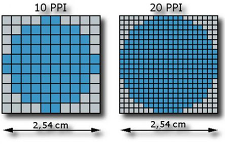

*图 1.1　光栅图形显示器由称为像素的量化元素组成*

## 1.2 第一套计算机图形系统（1949 年）

大多数人将计算机交互式 3D 图形的起点归于 MIT 的 Ivan Sutherland 于 1963 年开展的 Sketchpad 项目。然而，General Motors 早在 1959–1960 年就启动了 DAC-1，将其作为一种交互式曲面设计系统。Sketchpad 本身是一个二维系统，但它引入了至今仍在使用的概念，例如基于约束的绘图以及母版与实例。Tim Johnson 在 1964 年开发了 3D 版本 Sketchpad III[5]。

第一台建成的电子存储程序计算机是小型规模实验机（Small-Scale Experimental Machine，SSEM），昵称为 Baby。Frederic C. Williams、Tom Kilburn 和 Geoff Tootill 在曼彻斯特大学建造了它。第一段程序于 1948 年 6 月 21 日在这台机器上运行[6]。Baby 被设计用于使用和演示存储在阴极射线管（CRT）中的数据，这种 CRT 后来被称为 Williams 管。该管能够记忆 2048 位数据。这套系统证明，以适合计算机使用的速度可靠地读写数据是可行的。

### 第一台数字显示器诞生于 1948 年

Baby 配有一根类似示波器的小型显示管，可以显示字母数字数据。它不能绘制任意角度的直线，但人们利用点阵屏幕制作出了巧妙的图形图像。

在美国，海军研究办公室和美国空军资助了 Whirlwind 项目，目标是开发一台大型数字计算机，用于飞机仿真、空中交通管制等实时问题中的繁重计算。

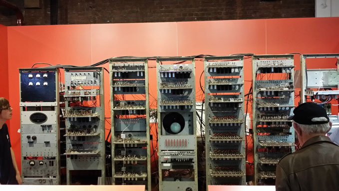

*图 1.2　1948 年 6 月在曼彻斯特大学建造的小型规模实验机（SSEM），昵称为 Baby*

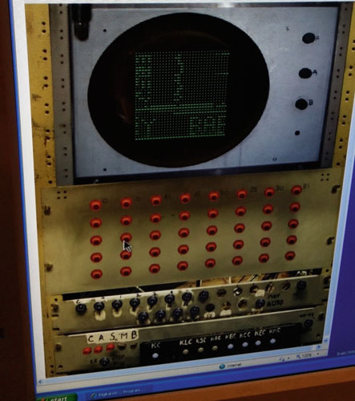

*图 1.3　Baby 的点阵显示器*

### 第一幅动画计算机图形（1949 年）

Whirlwind 项目于 1944 年在 MIT 伺服机构实验室启动，由 Jay Forrester 领导。后来，Whirlwind 和 Forrester 转入数字计算机实验室，开始专注于使用计算机显示空中交通管制和炮火控制图形。Forrester 的项目后来成为政府半自动地面环境（SAGE）计划的一部分，而 SAGE 又属于海军飞机稳定性与控制分析器（ASCA）项目。该系统计划作为可编程飞行仿真环境，并于 1951 年进行了演示[7]。

### 可编程飞行仿真（1951 年）

Whirlwind 计算机于 1948 年开始建造，共有 175 人参与，其中包括 70 名工程师和技术人员。到 1949 年第三季度，这台计算机已经能够解方程，并在示波器上显示结果；它甚至被用于第一款动画交互式计算机图形游戏《Blackjack》[8]。

### Whirlwind 是第一台用于计算机图形学的数字计算机

Whirlwind 是第一台使用视频显示器作为输出、并能够实时运行的计算机。它不仅仅是旧式机械系统的电子替代品[9]。Whirlwind 使用了新的磁芯存储器作为随机存取存储器（RAM），成为第一台采用这种存储器的计算机。SAGE 防空系统于 1958 年投入运行，并具备更先进的显示能力。

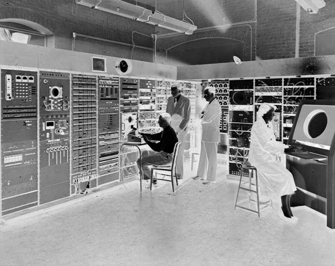

*图 1.4　Whirlwind——第一台交互式数字计算机。1950 年，Stephen Dodd（坐着）、Jay Forrester、Robert Everett 和 Ramona Ferenz 在 Barta 大楼的 Whirlwind I 测试控制显示器旁（图片来源：The MITRE Corporation）*

SAGE 防空系统大量借鉴了 Whirlwind 的经验。在 20 世纪 50 年代，它还配备了交互式图形控制台和光“枪”，用于模拟和跟踪敌方轰炸机的位置[10]。Robert Everett 设计了一种输入设备，称为光枪或光笔，使操作员能够获取飞机的识别信息。当光枪指向代表飞机的屏幕图标时，光笔会检测到屏幕发出的光，并向 Whirlwind 发送中断。随后，Whirlwind 会显示飞机的识别信息、速度和方向[11]。

### 1960 年第一批计算机生成的 3D 透视图像

1960 年，Boeing 的 William Fetter 制作了 3D 透视图，并为飞机驾驶舱制作了动画。他还与 Verne Hudson 一起创造了“计算机图形学”这一术语[12]。在 Fetter 的《通信中的计算机图形学》（*Computer Graphics in Communication*）一书中，他描述了如何绘制一系列 x、y 位置，再由计算机将这些点连接成直线段[13]。二维线条图是在由示波器和雷达屏幕演变而来的大型 30 英寸屏幕上绘制的。

### 直线（1962 年）

1962 年初，IBM 的高级技术人员 Jack Elton Bresenham（1964 年获斯坦福大学博士学位）开发了以其名字命名的直线绘制算法[14]。该算法最初用于 Calcomp 等 x-y 笔式绘图仪。与交互式笔画显示器不同，笔式绘图仪使用步进电机，每次移动一小段固定距离，可以向八个方向之一移动或绘制。问题在于，如何计算每一步应该移动的方向。

早期方法速度慢、成本高，因为需要进行乘法和除法。Bresenham 算法使用整数坐标，不需要乘法和除法，因此比其他方法更快。使用 Bresenham 算法在绘图仪上绘制直线，是一项重要成就；同样的技术至今仍适用于光栅显示器。

1963 年，MIT 研究生 Ivan Sutherland 开发并演示了一个名为 Sketchpad 的二维绘图程序。Sketchpad 是用于绘制基于约束的工程图的二维系统。它不是 3D 系统，但展示了交互式计算机图形学的强大能力[15]。

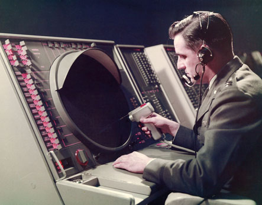

*图 1.5　使用 SAGE 防空显示器上的光枪选择目标飞机（图片来源：IBM）*

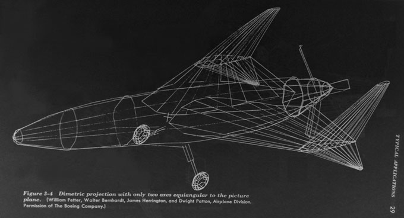

*图 1.6　William Fetter 在 Boeing 创作的 3D 透视图（图片来源：McGraw-Hill）*

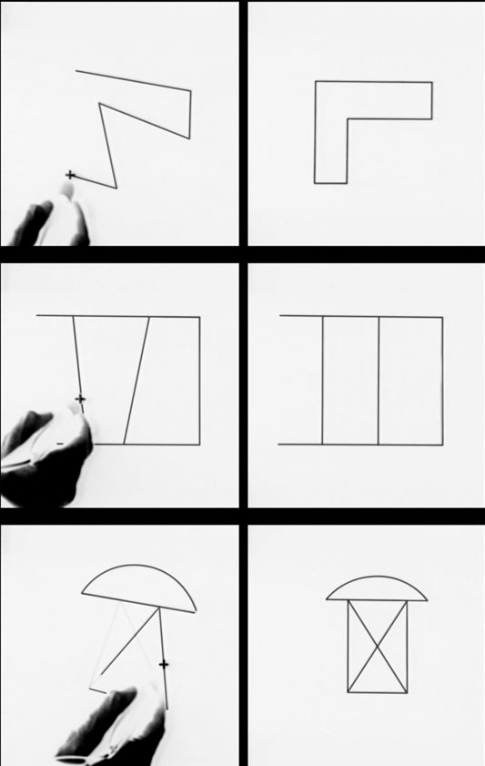

*图 1.7　Ivan Sutherland 演示 Sketchpad（图片来源：Wikipedia）*

自 20 世纪 50 年代 MIT 开发第一台实时 Whirlwind 计算机以来，计算机就已经拥有笔画式屏幕。20 世纪 60 年代初，小型测试设备公司 RMS 开始开发和制造完全晶体管化的字符发生器，并因此改名为 Information Displays, Inc.（IDI）。1963 年，Carl Machover、Kenneth King 和 Alfred Pestone 在 IDI 为英国国家工程实验室（NAL）开发了 IDIIOM 系统。

IDIIOM 是第一套独立式 CAD 平台。按照该公司的说法，它是第一台通用设计工作站、第一套商业 CADD 平台，也是第一套能够在自己的计算机上独立运行、无需连接大型机的软件绘图系统。与今天快速生成位图的 GPU 系统不同，IDI 显示系统使用矢量控制。Machover 评论说：

> 20 世纪 60 年代初，我们生活在一个矢量世界中。光栅并不是常见的计算机图形显示方式：存储位图的内存成本高得惊人。早期的大多数计算机图形系统都是笔画绘图器，也就是矢量绘图器，而不是光栅系统。直到 20 世纪 60 年代末和 70 年代初，随着位图存储成本下降，光栅才成为广泛使用的技术。在那之前，笔画绘图器所使用的偏转放大器功率非常大，需要消耗数千瓦。它们还需要很高的速度，因此显示器的最终成本始终过高[17]。

笔画式屏幕一直占据主导地位，直到 20 世纪 80 年代中期，光栅设备才成为主要的交互式显示技术。到 1968 年，Adage、Vector General 等公司已经推出具备通用 4×4 矩阵变换、裁剪和透视除法能力的系统。随后不久，IBM、Evans and Sutherland 等公司宣布推出商业系统，能够实时操纵带透视效果的 3D 线框模型。

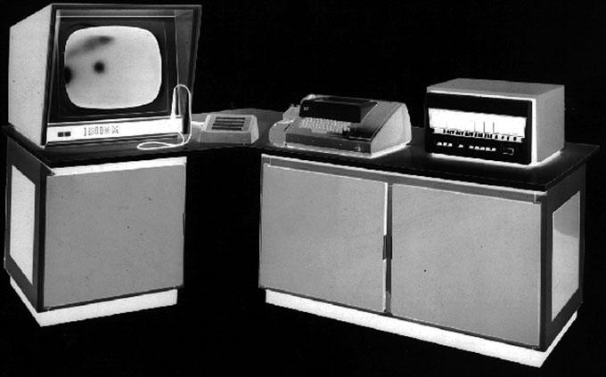

*图 1.8　第一台独立式工作站：IDI 的 IDIIOM，配有笔画式屏幕和光笔（图片来源：IEEE）*

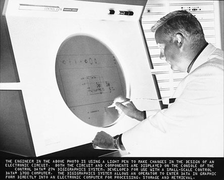

*图 1.9　工程师使用光笔操作 Control Data 274 Digigraphics 矢量显示终端，约 1965 年（图片来源：明尼苏达大学图书馆 Charles Babbage Institute Archives）*

显示器也在演进。基于电视技术的低成本光栅显示器取代了体积庞大且价格昂贵的矢量示波器。光栅也称为扫描线屏幕，为图形控制器奠定了基础，并建立了一种标准的图像表示方式。光栅显示器在 20 世纪 70 年代末和 80 年代初开始普及，而 1981 年 IBM PC 的推出又给予了它最重要的推动力。

### “像素”一词的出现（1965 年）

美国工程师 Frederic Crockett Billingsley[18] 开发了数字图像处理技术，用于支持美国发往月球、火星及其他行星的太空探测器。1965 年，Billingsley 发表了两篇使用 pixel 一词的论文，他可能是最早发表这一由 picture element（图像元素）缩合而成的新词的人[19, 20]。

### 第一台平板电脑和工作站（1972 年）

Alto 手持计算机项目始于 1972 年末。Alan Kay 在 Xerox 帕洛阿尔托研究中心（PARC）领导该项目。Alto 是 Kay 验证其 Dynabook 平板电脑设计理念的试验平台[21]。不过，Kay 意识到当时还不存在制造完整平板电脑所需的技术。他正确地预见到，这种技术直到世纪末才会出现。Kay 将 Alto 视为一种愿景，或一种号召，希望后来者继续将其发展为完整的 Dynabook。

多数技术史研究者认为，第一台工作站于 1972 年在 Xerox PARC 开发出来，当时 Alto 项目推出了一台用于研究的个人计算机。

### 游戏机问世（1972 年）

Magnavox Odyssey 是第一台商用家用电子游戏机，为 Atari 及其他公司铺平了道路。Sanders Associates 的一个小团队在 Ralph H. Baer 的领导下为 Magnavox 设计了 Odyssey[22]。它于 1972 年 9 月在美国完成并发布。Odyssey 由一个称为 Brown Box 的中央主机组成，连接电视机和两个矩形控制器。

### 个人计算机（1975 年）

Lamont Wood 将第一台 PC 的出现追溯到 1970 年的 Datapoint 2200[23]。这是一台小型独立办公计算机，并非面向消费者。Jonathan Titus 于 1974 年设计的 Mark-8 微型计算机，是第一台消费者可以亲自操作的计算机。它使用 Intel 8008 处理器。不久之后，MIT 完成了 Altair 8800 微型计算机原型。Titus 最初将这台计算机命名为 PE-8，以纪念《Popular Electronics》杂志。

### GPU 的起源——Pixel Planes（1980–2000 年）

1980 年的 Pixel Planes 项目，是通向 GPU 的基础项目。由于蛋白质研究需要生成 3D 图像，北卡罗来纳大学（UNC）在 1980 年开发了名为 Pixel Planes 的系统。这是一种设计图形硬件的新理念：为每个像素分配一个处理器。这样，屏幕图像的许多部分就可以同时生成，从而大幅提高图形程序的生成速度。在 Henry Fuchs 的领导下，UNC 的 Pixel Planes 工作一直持续到 1997 年，最终开发出该项目的最后一次迭代——PixelFlow。

直到 20 世纪 70 年代末和 80 年代初，笔画式图形终端仍是显示 CAD 图纸和其他线条图像的主要设备。Commodore、Radio Shack 等公司的微型计算机光栅显示器缺乏足够的计算能力。

GPU 的故事始于 1982 年第一款超大规模集成（VLSI）图形控制器的出现。这款芯片由 Nippon Electric Company（NEC）开发，点亮了整个行业，并被用于 CAD 终端、PC 和客户机—服务器显示系统。在它出现之前，终端所使用的图形控制器都是大型电路板，板上装有几十个分立逻辑芯片和存储器芯片。

当时最受欢迎的图形终端之一是 Tektronix 4014。但它的设计和制造早于著名的 NEC 7220 芯片。因此，与同类设备一样，它的电路板上安装了几十个逻辑芯片和存储器。4014 不在终端上执行计算；所有投影和变换都由连接的微型计算机或大型机完成。

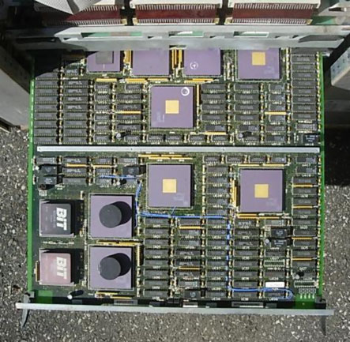

*图 1.10　Tektronix 图形终端系统电路板（图片来源：Legalizeadulthood）*

### 游戏中的 3D 图形（1983 年）

Atari 于 1983 年发布的多边形 3D 游戏《I, Robot》[24, 25]，是第一款商业生产和销售的此类游戏。带阴影的 3D 游戏类型在 1992 年随着《Wolfenstein 3D》出现而成熟。PC DOS 版本于 1992 年 5 月 5 日发布，灵感来自 Muse Software 在 20 世纪 80 年代推出的二维游戏《Castle Wolfenstein》和《Beyond Castle Wolfenstein》。评论家和游戏记者普遍认为，它在 PC 上普及了这一类型，并确立了后来第一人称射击（FPS）游戏所采用的基本“奔跑与射击”模式。

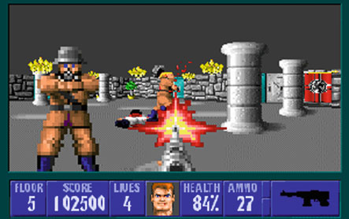

*图 1.11　《Wolfenstein 3D》是第一款基于 PC 的 3D 第一人称射击游戏（图片来源：Software & Apogee Software 1992 id）*

### 着色器（1988 年）

着色软件（也称为着色器）用于计算光照、颜色、反射、阴影、位置以及其他图像增强效果。Pixar 于 1988 年 5 月在 RenderMan Interface Specification 中引入了 shader 一词。早期着色器运行在 CPU 上。后来的图形处理器提供了专用硬件，使着色器能够直接运行在图形流水线中。第一款内置着色器能力的图形硬件设备是 Nvidia GeForce 3（NV20），发布于 2001 年 2 月 27 日。它只能处理像素着色器。不久之后，GPU 开始支持顶点着色器。顶点着色器负责处理 3D 模型的原始几何，并将其转换到显示器的坐标空间；像素着色器则负责处理像素的可见性和着色。

## 1.3 图形处理器单元（1999 年）

今天的 GPU 与 20 世纪 70 年代和 80 年代最早的图形控制器已经大不相同。现代 GPU 组合了多个处理阶段，是 VLSI 技术的受益者。到 1985 年，作为 GPU 前身的图形控制器已经具备异构功能，加入了音频和视频（AV）能力。随后，在 20 世纪 90 年代初，CPU 芯片组中出现了集成图形处理器（IGP）。

### SGI 于 1996 年为游戏机引入第一款 GPU

早在 1993 年，街机游戏系统电路板就已经具备硬件 T&L，例如 Real3D 为 Sega Model 2 开发的系统。游戏机则从 1996 年 SGI 为 Nintendo 64 开发的 Reality Coprocessor GPU 开始具备这一能力。PC 一直到 1999 年仍然通过软件实现 T&L。

### 3Dlabs 于 1997 年引入 GPU 一词

Jim Clark 于 1981 年引入了第一款集成几何引擎。1997 年，英国 3Dlabs 开发了第一款专用可编程 T&L 引擎，并将其称为 Glint Gamma 处理器。变换和光照是 Glint 工作站图形芯片的一部分。3Dlabs 首次在 Glint 芯片中使用 GPU 一词，原意是 geometry processor unit（几何处理器单元）。

Glint 是作为协处理器为工作站市场开发的；而在 1999 年，Nvidia 为消费市场推出了 GeForce 256。这是一款内置 T&L 引擎的单芯片图形处理器。Nvidia 推广了 GPU 作为 graphics processor unit（图形处理器单元）的含义。自此以后，该公司一直与这一术语联系在一起，并被认为发明了 GPU。

### Nvidia 于 1999 年制造出第一款单芯片 PC GPU

GPU 的应用范围十分广泛，为工业设计、科学计算、金融、航空航天、生物医学、自动驾驶和数据中心等领域提供计算能力。GPU 的计算能力大幅增长，并在游戏和电影领域发挥了主导作用。由于技术门槛高、所需投资巨大，Advanced Micro Devices（AMD）、Intel 和 Nvidia 等公司长期主导 GPU 市场。

要确定第一款 GPU 真正诞生的具体时刻很困难。可以被称为“第一”的日期有很多：项目启动日期、原型机运行日期、产品公布日期、第一颗芯片出货日期，或者第一位最终用户拿到产品的日期。由于所有公司始终都会使用的日期只有公布日期，因此本书采用产品公布日期。

### 1.3.1 图形控制器向 GPU 的演进

从最初的二维显示控制器到今天的 GPU，经历了多个步骤或阶段，而这些阶段并不一定呈线性关系。除去某些阶段转换，总体路径大致如图 1.12 所示。

1994 年 COMDEX 大会上，Intel 创始人兼董事会主席 Andy Grove 说：“我们需要实现内置的多媒体和通信能力……并且必须在即将到来的信息通道之前实现，否则这将使我们陷入非常不利的境地。”然而，Intel 直到 2010 年才集成视频或图形功能，真正的音频处理也直到 2016 年才出现。GPU 则在 20 世纪 90 年代末和 21 世纪初集成了这些功能。

2006 年，Nvidia 推出了源自 C++ 的专有并行编程软件 CUDA，即 Compute Unified Device Architecture（统一计算设备架构）。CUDA 是一个软件层，可直接访问 GPU 的虚拟指令集和并行计算单元，用于执行计算内核。

### 细分曲面、AI 与光线追踪（2000–2020 年）

软件开发者将原本运行在 CPU 上的专用计算机图形操作，转移到 GPU 内部的专用硬件加速器上。由于这一变化，这些功能的运行速度大幅提高。这是摩尔定律与“将处理器放到最需要性能的地方”相结合的结果。AMD 于 2001 年引入了硬件细分曲面。2018 年，Nvidia 引入了硬件 AI 和加速光线追踪。随后在 2020 年，Nvidia 推出 Ampere，这是当时制造的最大 GPU，拥有惊人的 380 亿个晶体管、8192 个处理器，以及数百个其他专用处理器。

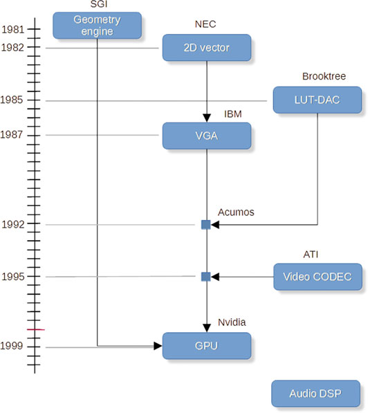

*图 1.12　GPU 的演进路径*

### 网格着色（2016–2020 年）

GPU 的发展从未放缓。2016 年，AMD 在 Graphics Core Next（GCN）Vega GPU 中引入了原始着色器。2018 年，Nvidia 在 Turing GPU 中引入了网格着色器能力。作为回应，Microsoft 于 2020 年 5 月推出 DirectX 12 Ultimate，使软件开发者能够利用这些硬件发展成果。

不久之后，Epic 在新款 PlayStation 5 上发布了网格着色演示，展示了实时生成数十亿个子像素的图像[26]。这些画面令人惊叹，使用了 Epic 称为 Nanite 虚拟化微多边形几何体的技术。这种新的细节层级几何体，使艺术家可以创建超出人眼分辨能力的多边形细节。

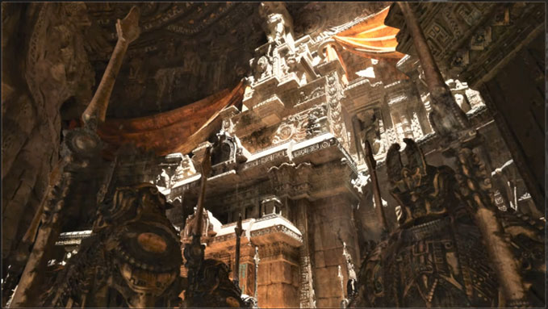

*图 1.13　上方的整幅图像均由计算生成，并非照片或纹理贴图（图片来源：Epic Games，Nanite 演示）*

## 1.4 性能（2000–2026 年）

在 GPU 的大部分历史中，厂商一直在围绕性能指标展开竞争。图形质量往往是主观判断，那么，如何说服客户相信自己的产品优于竞争对手，即使双方产品的性能非常接近？答案是性能指标。

计算机和计算机图形学的性能有多种衡量方式。没有一种方式绝对最好或最正确；选择哪种方式，取决于用户关心什么以及用户的理解程度。每秒十亿次浮点运算（GigaFLOPS）是一个不错的选项，因为它是一种经验测量方式，而且可以用于不同平台之间的比较。

在本书中，每秒十亿次浮点运算（GFLOPS）也有助于讲述性能发展的故事。图 1.14 展示了性能随时间的提升，并且可以看出性能增益似乎正在趋于平缓。许多观察者认为摩尔定律正在放缓。要记住，摩尔定律本质上是一个经济学观察：随着处理器数量不断增加，获得性能提升的成本也越来越高。光刻设备和其他制造设备甚至存在某种“逆摩尔定律”：工艺尺寸越小，设备成本可能翻倍。这反过来会推迟新工艺节点和新芯片的推出。

另一方面，现实限制也会推动人们创新，从纳米级和埃级晶体管中挤出更多性能，例如使用缓存架构技巧、多芯片、3D 内存堆叠、新材料，最重要的是软件。

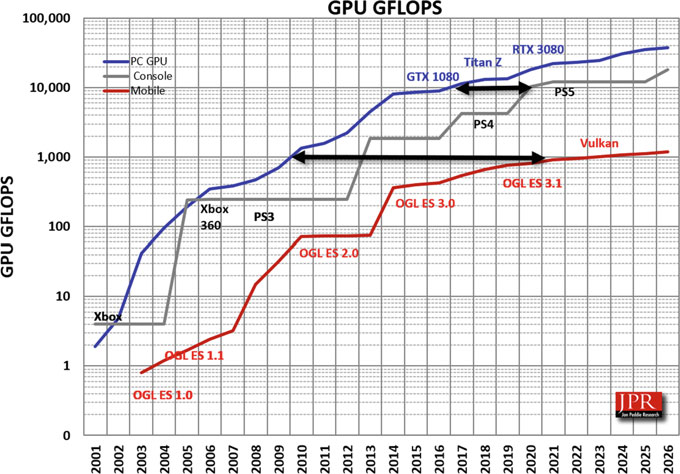

*图 1.14　流行平台随时间变化的性能*

## 1.5 GPU 角色的变化

随着 VLSI 图形控制器出现，成本下降，需求增加，产量上升。二十年后，拥有数百万个晶体管和并行处理器的 VLSI 芯片进入市场，并被称为图形处理器单元——GPU。

GPU 替代了 Tektronix 电路板上的全部逻辑器件，只留下存储器和少量输入/输出芯片。更重要的是，GPU 以系统板一小部分的成本，增加了新的、更强大的功能。

GPU 自问世以来不断演进，变得更加可编程，也越来越像计算平台，而不再只是专用图形引擎。因此，它如今已经成为数字技术进步的核心。GPU 也许永远会被用作图形引擎，但它还承担了其他计算角色，并加入了用于 AI 和光线追踪的专用计算引擎。

过去二十年中，硬件设计工具也不断发展。设计人员推出了易于安装和使用的工具，其中一些甚至可以在网页浏览器中运行，而且免费。原型开发板也更加普及，Raspberry Pi、micro:bit 以及其他厂商提供了大量现成开发板。在线商店、易于使用且功能强大的设计工具、咨询机构和合作伙伴、众筹、孵化器以及次日送达的物流网络，都降低了新项目的时间和成本，也降低了成熟公司和初创公司的项目风险[27]。

不过，这些工具、服务和支持并不能保证成功，尤其是消费类硬件产品，失败的例子很多。一个能够工作的原型只是起点。硬件开发的另一个挑战是资金：内部项目和初创公司都需要购买材料和制造设备。众筹缓解了部分财务障碍。开源知识产权（IP）也帮助组织开发新产品，使它们能够重复利用那些不构成新设计增值部分、但又是功能单元所必需的模块或功能。

这些基础设施和工具方面的改进，大多都得益于 GPU。GPU 甚至被用于制造更先进的 GPU。

20 世纪 90 年代末，设计人员为两种应用开发了强大的 GPU：PC 上的 CAD 和 3D 游戏。当时 CAD 市场小于游戏市场，但仍拥有数百万用户，而且其处理需求不断增长。规模更大的游戏市场为消费级 GPU 供应商提供了规模经济，使它们能够以较低价格提供设备。21 世纪初，计算机科学家认识到 GPU 作为并行处理器具有很高的性价比。消费级 GPU 开始配备自己的软件开发环境，并展示出解决某些困难计算问题的潜力。

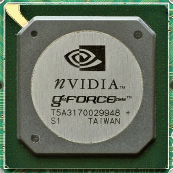

*图 1.15　Nvidia GeForce 256，第一款单芯片 GPU（图片来源：Konstantin Lanzet，Wikipedia）*

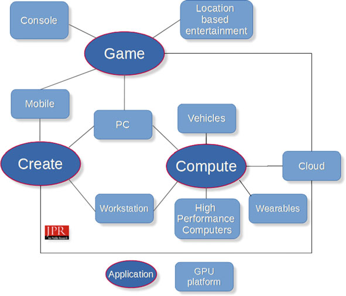

*图 1.16　GPU 已经无处不在，并加速了科学研究，带来了新产品、提升了车辆安全性以及许多其他应用*

## 1.6 GPU 的应用

由于 GPU 中的处理器（也称为着色器）具有冗余性，计算机架构师和工程师认识到 GPU 具有很强的可扩展性，因此它不仅适用于游戏，也适合其他应用和价格层级。随着 GPU 应用范围扩大，出现了多种新的编程语言，使 GPU 更容易使用。如今的 GPU 比以往更加高效，加速了更广泛的应用，并且已经像 CPU 和显示器一样无处不在。GPU 已经不再只是用于游戏。

### 1.6.1 人工智能与机器学习

AI 和 ML 是 GPU 最令人兴奋的应用之一。AI 使用机器学习、深度学习以及其他技术来解决实际问题。计算机科学家、机器学习先驱 Tom M. Mitchell 将机器学习定义为：“研究能够让计算机程序通过经验自动改进的计算机算法。”[28]

GPU 采用单指令多数据（SIMD）结构，非常适合处理大量数据。因此，GPU 可用于图像识别、推荐系统和数据库索引等天然会产生大型数据集的应用。不过，只有在 CPU 与 GPU 之间的数据通路足够快，并且算法能够并行实现时，GPU 才能有效处理大规模数据。

AI 和 ML 使用深度学习技术以及反卷积神经网络（DNN）创建庞大的数据集，而传统 CPU 可能需要数年才能处理这些数据。GPU 则可能在几分钟内完成处理。这样的速度使研究人员更快获得答案，从而能够继续提出下一个问题，并加速科学研究和医学研究。

### 1.6.2 加速计算与超级计算机

还有一类问题涉及数量极其庞大、同时具有某些共同属性的数据。信用卡交易就是一个例子。每天有数亿人使用信用卡，远程计算机必须即时完成交易，同时在几秒钟内检查交易是否欺诈以及资金是否充足。

科学家和工程师会创建病毒和车辆的仿真模型，其中包含数百万到数万亿个数据点。随后，这些数据点会受到压力测试，相邻数据点产生的影响同样重要，因此分析必须尽可能快速完成。进行这类工作的工程师和科学家经常会说：“我需要在退休或去世之前得到答案。”

GPU 被用作超级计算机中的加速协处理器，用来加速问题中特定且专门化的部分，而不是执行通用工作、系统操作或开销函数。

### 1.6.3 内容创作

最初的图形处理器使用 CAD 为工程图绘制直线。CAD 是第一种数字内容创作（DCC）应用，至今仍然是重要需求。绘制直线相对简单，但要让线条围成的区域看起来真实、行为准确，给它们添加阴影就复杂得多。如今，GPU 已在视频编辑、渲染和惊人的特效制作中占据重要地位。

后来，GPU 又被用于制作和模拟演员、想象中的太空、古代帆船、老虎以及蚂蚁等动画。电影、电视和现代游戏的内容创作，以各种方式不断挑战 GPU。

### 1.6.4 游戏

由于有大量人群玩电子游戏，游戏一直是重要的计算机应用。早在 1949 年，计算机上就出现了游戏[29]。视频游戏，尤其是冒险游戏和第一人称世界游戏，本质上都是大型仿真。模拟和渲染这些复杂环境，已经超出了单个 CPU 的能力。图形处理器最初作为协处理器开发，承担了从主 CPU 卸载出来的复杂场景和动作渲染任务。这些游戏通常要求每秒 30 到 60 帧，现在还常常要求 120 帧。

随着对真实性和速度的需求不断提高，游戏推动 GPU 发展到了新的高度。游戏的计算量越来越大，图像越来越逼真，游戏世界也越来越庞大。GPU 与复杂程度不断提高的游戏以及高分辨率显示器同步发展，显示分辨率已经达到 5K 和 8K（分别约为 1100 万和 3300 万像素），并且正在向 16K（约 7500 万像素）发展。这类显示器给 GPU 带来的负担呈指数级上升。

### 1.6.5 分子建模

分子建模是使用计算机研究分子及其性质的方法。20 世纪 60 年代，科学家和化学家在大型 CRT 屏幕和笔式绘图仪上制作分子的线框可视化图像。

20 世纪 60 年代中期，MIT 开发了第一套分子结构交互式显示系统。它运行在早期的分时大型计算机 Project MAC（Multi-Access Computer）上。Cyrus Levinthal 及其同事设计了一个用于蛋白质结构的模型构建程序[30]。

分子结构很适合用来开发计算机图形工具，因为数据相对容易生成，结果通常也具有良好的视觉效果。分子图形特别适合表现静电势等分子的整体和局部性质。图形模型还可以制作动画，用来表示分子过程和化学反应。

### 1.6.6 视频和照片编辑

包括照片编辑在内的成像处理，也是 GPU 的早期应用。数字照片和计算机生成图像一直在推动处理能力的极限，因为艺术家和摄影师希望操纵每一个像素，以制作特效、修正瑕疵和删除元素。

在视频领域，第一套真正的非线性编辑系统是模拟的 CMX 600，由 CMX Systems 于 1971 年推出；CMX Systems 是美国哥伦比亚广播公司（CBS）与 Memorex 的合资企业。这一概念后来转移到计算机上，并在 20 世纪 90 年代初开启了数字非线性视频编辑（DNLE）时代。第一套 DNLE 是 Quantel 的 Harry，于 1985 年发布，是第一套全数字视频编辑和特效合成系统。

现代 GPU 拥有专用的视频压缩和解压缩（编解码器）引擎，能够更高效地完成视频制作和播放。GPU 也用于转码，即把一种视频格式转换为另一种格式。AMD 和 Intel 还在 CPU 中集成了专用转码引擎，其效率甚至更高。

### 1.6.7 车辆导航与机器人

GPU 能够处理大量输入数据并计算结果，因此非常适合处理自动驾驶车辆所需的各种输入。自主机器人也有类似需求。GPU 可用于从概念设计、仿真和测试，直到部署为设备控制器的所有阶段。

### 1.6.8 加密货币挖矿

2015 年末，基于 Ethereum 等加密货币的交易监测使用图形加速卡（AIB）对网络进行暴力搜索，以寻找相关交易。这种做法称为挖矿或加密货币挖矿。随着加密货币相对于美元的价值上升，对 AIB 的需求也上升，导致价格上涨、市场严重失真，并造成供应短缺。2021 年，Nvidia 推出了一类称为 Cryptocurrency Mining Processor（CMP）的 GPU，由此形成“挖矿 GPU”（mGPU）这一称呼。通过这种方式，该公司试图确保 GeForce AIB 能够供应给游戏玩家，并使供需恢复平衡。

### 1.6.9 小结

前面的内容简要回顾了 GPU 的一些应用领域。随着相邻市场认识到大规模并行处理的优势，应用清单还会不断扩大。仅 AI 领域可能就有 50 种以上的应用；上文总结的是其中一些最重要的应用。

## 1.7 GPU 的多重角色需要额外的名称

GPU 已经扩展到多个平台，因此形成了若干标准化的命名体系：

- 类别名称，例如 GPU、CPU 和 APU；
- 架构（也称微架构），例如 AMD 的 Radeon DNA（RDNA）、Intel 的 Xe 或 Nvidia 的 Ampere；
- 代号，例如 AMD 的 Navi、Intel 的 Arc 或 Nvidia 的 A40；
- 型号名称或编号，例如 AMD 的 Navi21 和 Nvidia 的 GA100；
- AIB 的品牌和型号，例如 AMD Radeon RX 6000、Intel Alchemist 或 Nvidia RTX 3080 Ti；
- 代际名称，例如 AMD Radeon 6000 或 Nvidia 3000。由于制造商采用的命名方式不稳定，代际名称并不可靠。

| 型号名称 | 产品名称 | 架构名称 |
|---|---|---|
| NV04 | Riva TNT、TNT2 | Fahrenheit |
| NV10 | GeForce 256、GeForce 2、GeForce 4 MX | Celsius |
| NV20 | GeForce 3、GeForce 4 Ti | Kelvin |
| NV30 | GeForce 5、GeForce FX | Rankine |
| NV40 | GeForce 6、GeForce 7 | Curie |
| NV50 | GeForce 8、9、100、200、300 | Tesla |
| NVC0 | GeForce 400、500 | Fermi |
| NVE0 | GeForce 600、700、GTX Titan | Kepler |
| NV110 | GeForce 750、900 | Maxwell |
| NV130 | GeForce 1060、1070 | Pascal |
| NV140 | Nvidia Titan V | Volta |
| NV160 | GeForce RTX 2060、GTX 1660 | Turing |
| NV170 | GeForce RTX 3060、RTX 3070 | Ampere |

AMD 的 AIB 营销名称是 Radeon，Intel 的是 Arc，Nvidia 的是 GeForce。尽管不准确，但把 AIB 称为 GPU 已经很常见。对许多消费者和记者而言，这些术语已经混用、难以区分。这就像把汽车称为发动机。人们也经常用 card（卡）来指代 AIB。本书采用 AIB，因为它更加具体、更加准确。

GPU 最初的用途，是加速游戏和 CAD 可视化中的图形流水线。显示 3D 模型需要对模型进行几何处理（改善网格质量）和矩阵数学运算（完成变换和投影），之后还要进行渲染以确定每个像素的颜色。渲染能够显示透明、反射和平滑等视觉效果。这两类任务彼此独立，却都能从高速并行处理中获益。使用 GPU 处理器确定正确渲染颜色的算法，后来被称为着色器。

### 着色器与处理器

着色器一词已经逐渐成为处理器的同义词。人们会谈论 GPU 中有多少个着色器，也会把用于细分曲面的固定功能处理器称为细分着色器。严格来说，着色器是运行在处理器上的程序，有时也用来指固定功能处理器。不过，这一区分并不总是得到遵守，因此 GPU 中的并行处理器通常也被称为着色器。

SIMD 是 GPU 使用的架构类型。CISC（复杂指令集计算机）是 x86 CPU 使用的架构类型。RISC（精简指令集计算机）则用于移动设备中的 CPU。GPU 和 CPU 的架构都有自己的名称，例如 AMD RDNA、Intel Golden Cove 和 Nvidia Hopper。

一种架构设计可以用于多个版本或多个代际，并获得一个代号，例如 AMD Navi、Intel Alder Lake 或 Nvidia Ampere。不同型号或版本可以组成一个产品家族，例如 AMD Radeon、Intel Core 和 Nvidia RTX。GPU 可以安装在图形 AIB 上，也可以直接安装在 PC 的系统板上。系统板也叫主板（motherboard），简称 mobo。每块 AIB 都有品牌名和型号名，例如 AMD Radeon RX 6000、Intel Core 第 n 代，或 Nvidia RTX 3080。

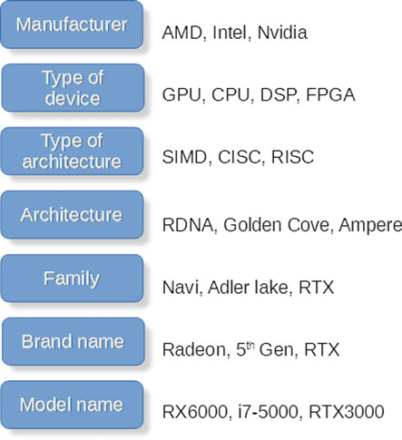

*图 1.17　名称的分类体系*

量产 GPU 很快达到了与 x86 处理器相当的规模经济，成为具备巨大计算密度且具有成本效益的处理器。不久之后，GPU 被用作计算加速器。随着时间推移，基于 GPU 的系统进入全球 500 台最快超级计算机的前十名，而且此后再也没有离开过这个排名。

后来，GPU 又被集成到 x86 CPU 和基于 ARM 的片上系统（SoC）中，成为共享内存 GPU。

### 第一款 eGPU 由 ATI 于 2008 年推出

随着笔记本电脑变得更薄、更轻，强大 GPU 所需的功耗和空间变得难以接受。设计人员开发了用于连接 GPU 的高速连接技术，例如 PCI Express（PCIe）。但线缆、连接器和线路驱动器带来的复杂性，使这种方案成本高昂且笨重。Fujitsu 提供了一款称为 Amilo GraphicsBooster 的 PCIe 产品[32]。

Thunderbolt 和随后 USB-C 的出现，使外置 GPU 变得实用。USB-C 能够通过成本较低、带宽较高的线缆和连接器传输 PCIe 信号，因此外部 AIB/GPU 可以成为一种实用的扩展坞方案。不过，额外的机箱和电源仍然推高了价格。

## 1.8 GPU 的类型

GPU 已经在多种不同平台和应用中发展，同时共享相似的指令集架构（ISA）和应用程序接口（API）套件。业界通常使用小写前缀来区分 GPU 类型：

- **dGPU**——独立的离散处理器，拥有自己的高速专用内存；dGPU 位于 AIB 上，也可以位于笔记本电脑的系统板上。
- **iGPU**——处理器数量少于离散 GPU 的缩小版本，与 CPU 共享本地 RAM。
- **vGPU**——AIB 上的虚拟 GPU，而功能强大的 dGPU 位于远程云端或校园服务器中。
- **mGPU**——用于加密货币挖矿的 GPU，后来称为 CMP，即加密货币挖矿 GPU。
- **eGPU**——带有 dGPU 的外部 AIB，安装在独立机箱中，通常用作笔记本电脑的图形增强器和扩展坞。eGPU 一词也可以指嵌入式 GPU 和 ExpressCard GPU[33]。

2008 年，ATI 展示了 External Graphics Port（XGP），即连接到笔记本电脑的外部 GPU 机箱，是第一家展示这一概念的公司。

GPU 以 dGPU 和 iGPU 的形式存在于 PC 中，而且一台 PC 中往往同时存在两者；GPU 也存在于智能手机和平板电脑的 SoC、游戏机以及汽车中，还被用作超级计算机和服务器中的计算加速器。飞机和船舶驾驶舱、增强现实（AR）和虚拟现实（VR）系统、照相机、数字电影放映机、机器人、科学仪器、玩具、家庭安防设备、电视、可视化和仿真系统中，也都能找到 GPU。

GPU 源于对更快、更逼真的游戏的需求，但 GPU 市场远不只是游戏市场。它已经成为一个关键任务市场，具有很高的需求、高风险、非凡的开发强度，并且其进步幅度远远超过摩尔定律。

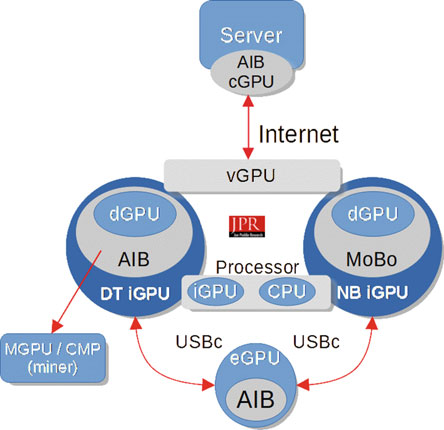

*图 1.18　GPU 存在于多种系统中，并具有不同前缀*

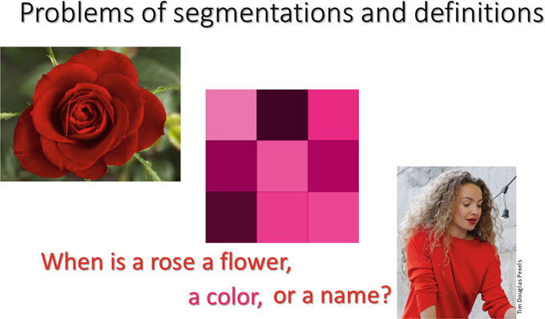

*图 1.19　分类和名称所造成的问题*

在任何书籍、讨论或演示中，正确使用术语都很困难。如上图所示，同一个名称可能指代多个不同对象，而同一个对象也可能有多个名称。这就是“术语的暴政”[34]。

## 1.9 结论

本章介绍了 GPU 的历史，以及描述 GPU 和其所处环境时使用的许多术语。GPU 从本世纪初开始就一直与我们相伴；但它们并不是像蒲公英一样突然出现的。对 GPU 的需求始于 20 世纪 60 年代。当时甚至还没有 GPU 这个术语，只有一种需求和愿望。

计算机图形学一直受到内存的限制。20 世纪 60 年代，内存比 CPU 更加宝贵。如今，内存按单位计算的价格已经低于为它服务的处理器。不过，即使如此，32 GB RAM 仍然可能占到一块 AIB 价格的近三分之一，因此内存仍然不便宜——只是变得更加充足和可靠。

GPU 是非凡的设备，但正是 VLSI 和摩尔定律使它成为可能。

## 参考文献

以下条目按原文顺序保留；书名、论文名、机构名和网址保留原文，以便检索。

1. Redmond, K. C. 和 Smith, T. M. *Project Whirlwind: The History of a Pioneer Computer*。Bedford, MA：Digital Press。ISBN 0-932376-09-6（1980）。
2. Canning, C.，“Predicting the Past”。*The Lark*，2017 年 4 月 5 日。https://www.larktheatre.org/blog/predicting-past/
3. “Moore’s law”。*Moore’s law – Wikipedia*。https://en.wikipedia.org/wiki/Moore%27s_law
4. Smith, A. R.，*A Biography of the Pixel*。MIT Press。https://mitpress.mit.edu/books/biography-pixel（2021 年 8 月 3 日）。
5. Yares, E.，“50 years of CAD”。*Design*，2013 年 2 月 13 日。https://www.designworldonline.com/50-years-of-cad/
6. “The Manchester Small Scale Experimental Machine – ‘The Baby’”。http://curation.cs.manchester.ac.uk/computer50/www.computer50.org/mark1/new.baby.html
7. Committee on Innovations in Computing and Communications: Lessons from History, National Research Council，*Funding a Revolution: Government Support for Computing Research*。The National Academies Press。ISBN-10: 0-309-06278-0（1999）。
8. Fedorkow, G.，“Gambling On Whirlwind: How The US Navy Spent $3 Million+ And Got A Computer Game”。Computer History Museum，2019 年 10 月 22 日。https://computerhistory.org/blog/gambling-on-whirlwind-how-the-us-navy-spent-3-million-and-got-a-computer-game/
9. Peddie, J.，“Developing the Computer”。载于 *The History of Visual Magic in Computers*，Springer Nature Switzerland AG，第 148–158 页（2013）。
10. Jacobs, J. F.，*The SAGE Air Defense System: A Personal History*。MITRE Corporation（1986）。
11. Carlson, W. E.，*Computer Graphics and Computer Animation: A Retrospective Overview*。Ohio State University（2017）。https://ohiostate.pressbooks.pub/graphicshistory/
12. Oppenheimer, R.，“William Fetter, E.A.T., and 1960s Computer Graphics Collaborations in Seattle”（2005）。https://www.academia.edu/7801224/William_Fetter_E_A_T_and_1960s_Computer_Graphics_Collaborations_in_Seattle
13. Fetter, W. A.，*Computer Graphics in Communication*。McGraw-Hill，第一版（1965 年 1 月 1 日）。https://openlibrary.org/works/OL7390788W/Computer_graphics_in_communication
14. Bresenham, J. E.，“Algorithm for computer control of a digital plotter”。*IBM Systems Journal*，第 4 卷第 1 期（1965）。https://ieeexplore.ieee.org/document/5388473
15. Kasik, D. 和 Senesac, C. J.，“Visualization: Past, Present, and Future at The Boeing Company”（2014）。http://gpdisonline.com/wp-content/uploads/past-presentations/DX28_Boeing-Kasik-Senesac-Visualization-DX-Open.pdf
16. Bissell, Don，“Was the IDIIOM the First Stand-Alone CAD Platform?”。*IEEE Annals of the History of Computing*，第 20 卷第 2 期，1998 年 4–6 月。https://ieeexplore.ieee.org/cart/download.jsp?partnum=667292&searchProductType=IEEE%20Journals%20Magazines
17. Don Bissell 于 1997 年 3 月 14 日对 Carl Machover 的访谈。
18. Billingsley, C. B.。https://en.wikipedia.org/wiki/Frederic_C._Billingsley
19. Billingsley, C. B.，“Digital Video Processing At JPL”。SPIE，第 0003 卷（1965 年 9 月 26 日）。
20. Richard, L.，“Pixels and Me”。演讲。https://www.youtube.com/watch?v=D6n2Esh4jDY
21. “Dynabook”。https://history-computer.com/products/dynabook-complete-history-of-the-dynabook-computer/
22. Martin, D.，“Ralph H. Baer, Inventor of First System for Home Video Games, Is Dead at 92”。*New York Times*，2014 年 12 月 7 日。https://www.nytimes.com/2014/12/08/business/ralph-h-baer-dies-inventor-of-odyssey-first-system-for-home-video-games.html
23. Wood, L.，*Datapoint: The Lost Story of the Texans Who Invented the Personal Computer Revolution*。Hugo House Publishing, Ltd.，Englewood, CO（2010）。
24. “I, Robot – Videogame by Atari”。*Killer List of Videogames*（1983）。检索日期：2009 年 8 月 19 日。
25. “I, Robot (arcade game)”。http://en.wikipedia.org/wiki/I,_Robot_(arcade_game)
26. “A first look at Unreal Engine 5”。2020 年 6 月 15 日。https://www.unrealengine.com/en-US/blog/a-first-look-at-unreal-engine-5
27. Hodges, S. 和 Chen, N.，“Long Tail Hardware: Turning Device Concepts Into Viable Low Volume Products”。*IEEE Pervasive Computing*，第 18 卷第 4 期，2019 年 10–12 月。https://doi.org/10.1109/MPRV.2019.2947966
28. Iriondo, Roberto，“Machine Learning (ML) vs. Artificial Intelligence (AI)—Crucial Differences”。https://medium.com/towards-artificial-intelligence/differences-between-ai-and-machine-learning-and-why-it-matters-1255b182fc6
29. Peddie, J.，“Developing the Applications”。载于 *History of Visual Magic in Computers: How Beautiful Images are Made in CAD, 3D, VR, and AR*，第 81 页。Springer，London（2013）。
30. Francoeur, E.，“Cyrus Levinthal, the Kluge and the Origins of Interactive Molecular Graphics”。*Endeavour*，第 26 卷第 4 期（2002）。https://tinyurl.com/995uczze

## 译注

1. 原文将 “The Graphics Processor Unit” 用作本节标题；技术语境中通常将 GPU 展开为 “Graphics Processing Unit”，译为“图形处理器单元”。本译文保留原文标题含义，并在正文中统一译为“图形处理器”或“GPU”。
2. 原文将 dGPU、iGPU、vGPU、mGPU 和 eGPU 作为不同用途和部署方式的前缀。译文保留这些缩写，并在首次出现时给出中文解释。
3. 本章原 PDF 包含多幅嵌入图片。译文保留图号、图题和正文位置；图片本身继续使用原始 PDF 中的英文图像，不对图片内容进行覆盖或改写。图片已从原始 PDF 提取，并在对应图题前使用原图引用。
4. 原文中个别历史判断、术语展开和产品名称可能存在需要进一步核对之处。本译文不擅自改写原文事实；需要核查的地方保留在审校记录中。
